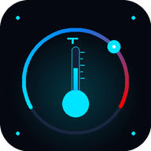

#  ThermaCore Documentation

Welcome to the official documentation for **ThermaCore**, the premium open-source thermal monitoring solution for Android.

## Understanding Thermal Zones

Unlike battery temperature (which is standardized), Android "Thermal Zones" are raw hardware identifiers provided by the kernel via `sysfs`. 

### Common Identifiers
Depending on your SoC (System on a Chip), you might see:
- **tsens_tz_sensor**: Qualcomm Snapdragon sensors.
- **mtk-therm**: MediaTek thermal controllers.
- **cpu-0...cpu-n**: Individual core temperatures.
- **soc_thermal**: Overall package heat.

### EMA Smoothing
ThermaCore uses an **Exponential Moving Average (EMA)** to filter out rapid micro-fluctuations in CPU heat. This ensures that the UI remains stable while the underlying engine captures every spike for the 24-hour cooling health calculation.

## Privacy & Ethics
ThermaCore is designed to be **F-Droid Compliant**:
- No internet permission (`INTERNET` is not even in the manifest).
- No analytics or telemetry.
- No closed-source SDKs or ad-trackers.

## Dashboard Guide
- **PU Temp**: The primary smoothed temperature of your SoC.
- **Cooling Score**: A calculated 0-100 health score. 100 means the device is running optimally; <30 indicates severe thermal throttling.
- **Zone Chips**: Tap individual chips to see granular data for that specific sensor.

---
*ThermaCore: Pro-grade thermal monitoring, complete privacy.*
